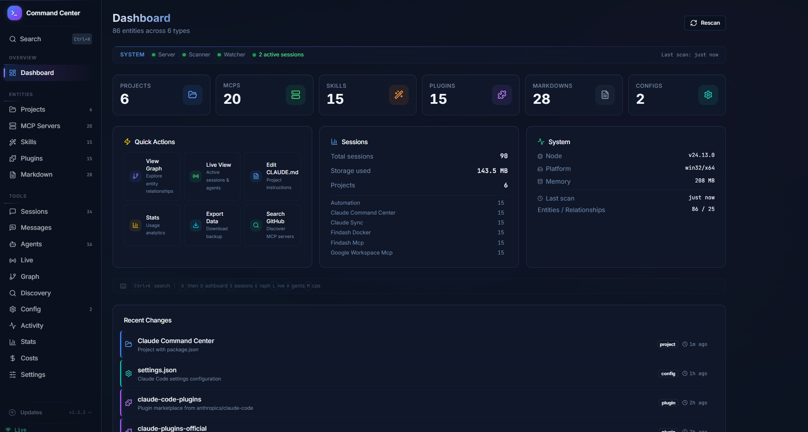
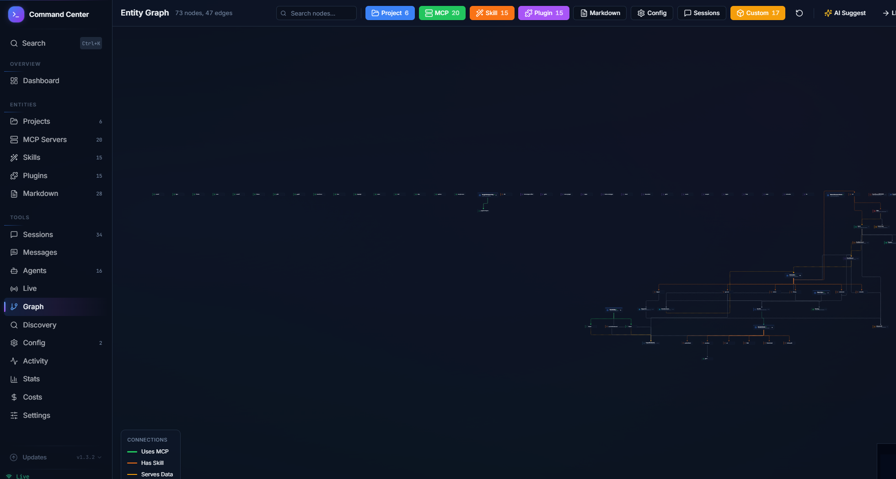
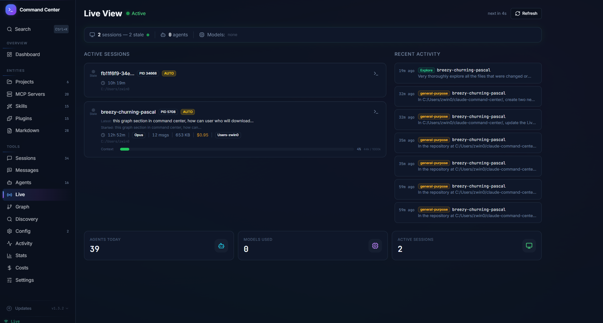
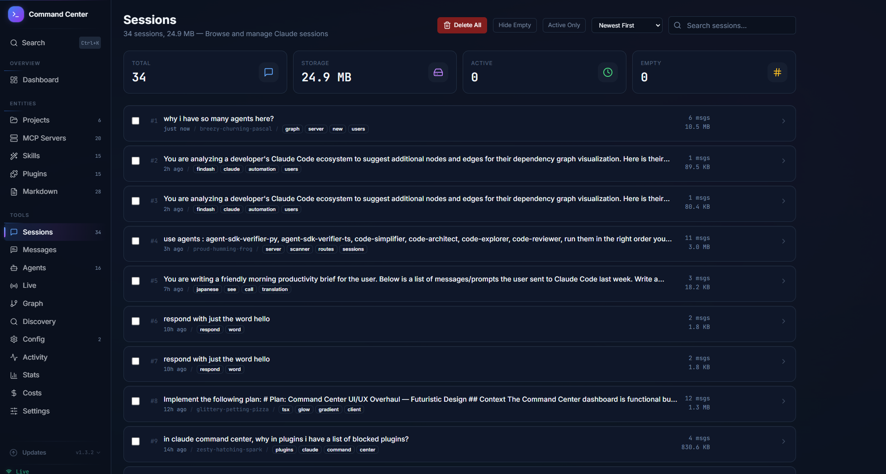
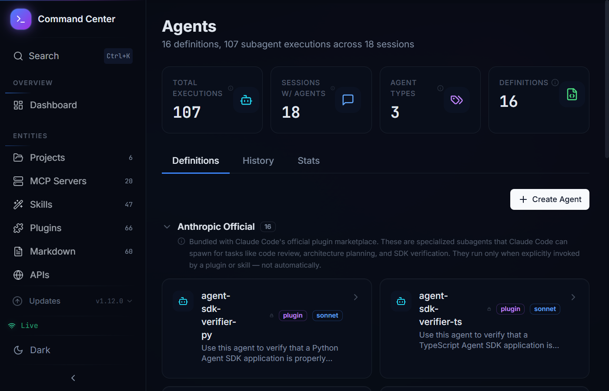
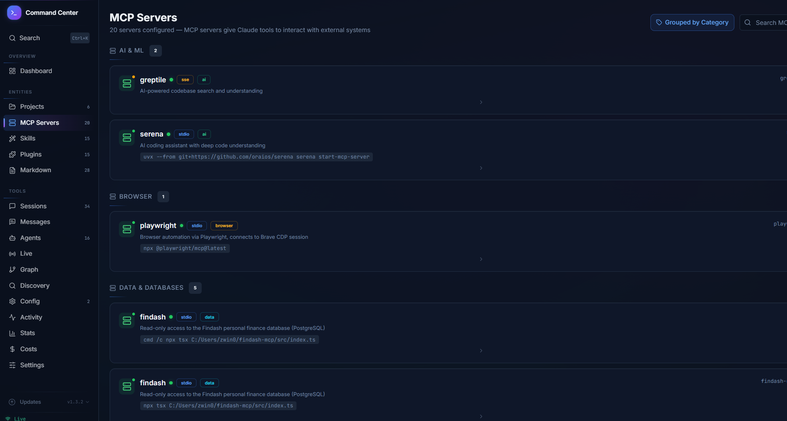
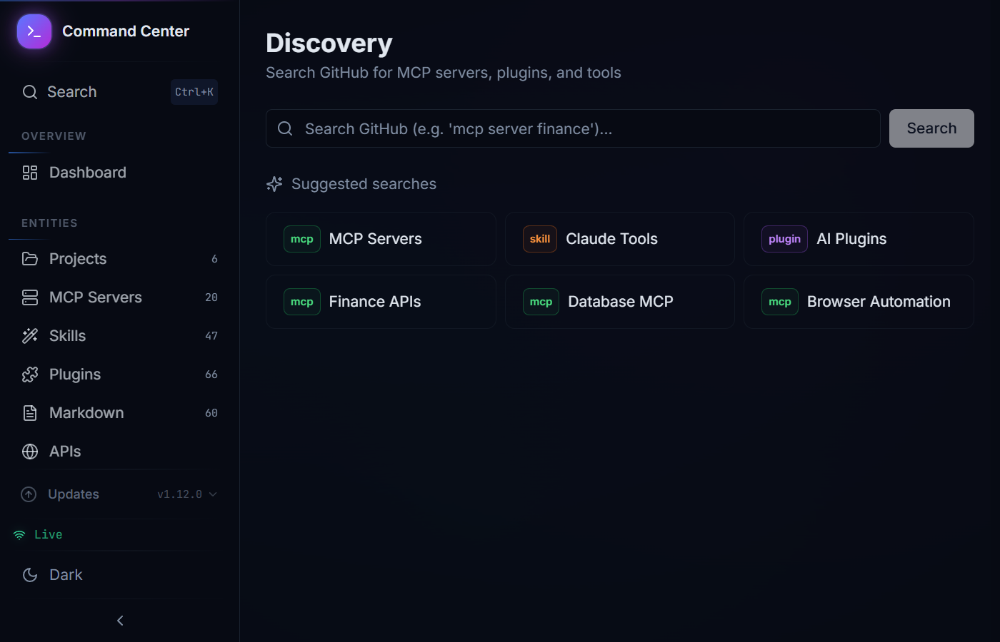

<div align="center">

# Claude Command Center

**A bird's-eye view of your entire Claude Code setup.**

[](https://github.com/sorlen008/claude-command-center/actions/workflows/ci.yml)
[](LICENSE)
[](https://nodejs.org)
[](https://www.typescriptlang.org)

[Setup Guide](SETUP.md) | [Security](SECURITY.md) | [Contributing](CONTRIBUTING.md) | [Changelog](CHANGELOG.md)

</div>

---

A local dashboard for visualizing and managing your [Claude Code](https://docs.anthropic.com/en/docs/claude-code) ecosystem. Auto-discovers your projects, MCP servers, skills, plugins, sessions, agents, and their relationships with zero configuration.



<details>
<summary><strong>More screenshots</strong></summary>

| | |
|---|---|
|  |  |
| **Graph** -- interactive ecosystem map with AI suggestions | **Live** -- real-time sessions, context usage, cost estimates |
|  |  |
| **Sessions** -- search, filter, sort, bulk delete | **Agents** -- definitions and execution history |
|  |  |
| **MCP Servers** -- every server from all `.mcp.json` files | **Discovery** -- find unconfigured projects and MCPs |

</details>

---

## Quick Start

### Option 1: npm (recommended)

```bash
npm install -g claude-command-center
claude-command-center
```

### Option 2: From source

```bash
git clone https://github.com/sorlen008/claude-command-center.git
cd claude-command-center
npm install
npm run dev
```

Open [http://localhost:5100](http://localhost:5100). Everything is auto-discovered from your `~/.claude/` directory.

See [SETUP.md](SETUP.md) for detailed installation instructions and troubleshooting.

## Requirements

- **Node.js 18+** (tested on 20, 22, 24)
- **Claude Code** installed -- the dashboard reads from `~/.claude/` which Claude Code creates
- **git** -- required for the update feature (optional otherwise)

## Features

- **Auto-discovers** all Claude Code projects, MCP servers, skills, plugins, and markdown files
- **Session browser** -- search, filter, sort, and manage sessions with bulk operations
- **Agent tracker** -- definitions and execution history across sessions
- **Live view** -- real-time monitoring with context usage, message counts, and cost estimates
- **Graph visualization** -- interactive ecosystem map with AI-assisted suggestions and `graph-config.yaml`
- **Markdown editor** -- edit `CLAUDE.md` and memory files with version history
- **Discovery** -- finds unconfigured projects and MCP servers on disk
- **Config viewer** -- inspect Claude Code settings, MCP configs, and permissions
- **Activity feed** -- timeline of recent file changes from the watcher
- **One-click updates** -- check and apply updates from the sidebar

## Pages

| Page | Description |
|------|-------------|
| **Dashboard** | Entity counts, health indicators, quick stats |
| **Projects** | Discovered projects with session counts and tech stack |
| **MCP Servers** | Every MCP server found in `.mcp.json` files |
| **Skills** | User-invocable and system skills |
| **Plugins** | Installed and available plugins |
| **Markdown** | All `CLAUDE.md`, memory files, READMEs with editing |
| **Sessions** | Full session history with search, sort, bulk delete |
| **Agents** | Agent definitions and execution logs |
| **Live** | Active sessions, agents, context usage, cost estimates |
| **Graph** | Interactive node graph with custom nodes and AI suggestions |
| **Discovery** | Unconfigured projects and MCP server suggestions |
| **Config** | Claude Code settings, permissions, MCP configs |
| **Activity** | File-change timeline from the watcher |

## Security and Privacy

**This tool runs entirely on your local machine.**

| Concern | Details |
|---------|---------|
| **File system** | Reads `~/.claude/` and project directories. Writes only to `~/.claude-command-center/` and markdown files you explicitly edit. |
| **Shell commands** | Spawns `claude -p`, `git`, platform file openers, terminal emulators. All user input validated with Zod. |
| **Network** | Binds to `127.0.0.1` only. No outbound requests unless you use Discovery search or AI Suggest. |
| **Data** | All data stored locally as plain JSON. No cloud sync, no external databases. |
| **Telemetry** | None. No analytics, no tracking, no phone-home. |
| **Secrets** | Never stored. Scanned env vars with "secret", "password", "token", "key" are redacted to `***`. |

See [docs/security-threat-model.md](docs/security-threat-model.md) for the full threat model.

## Configuration

| Variable | Default | Description |
|----------|---------|-------------|
| `PORT` | `5100` | Server port |
| `HOST` | `127.0.0.1` | Bind address. **Do not set to `0.0.0.0`** -- no authentication. |
| `COMMAND_CENTER_DATA` | `~/.claude-command-center/` | Data directory |
| `GITHUB_TOKEN` | (none) | Optional. GitHub API rate limits for Discovery. |

## Graph Configuration

Extend the auto-discovered graph with custom nodes via `graph-config.yaml`:

```yaml
nodes:
  - id: my-database
    type: database
    label: "PostgreSQL"
    description: "Primary database on :5432"

edges:
  - source: my-mcp-server
    target: config-my-database
    label: connects_to
```

Place in `~/`, `~/.claude/`, or any project directory. See [SETUP.md](SETUP.md#graph-configuration) for details.

**AI Suggest** -- click the button in the graph toolbar to get AI-generated suggestions for infrastructure nodes and connections. Requires Claude Code CLI.

## Building and Updating

```bash
npm run build    # Bundle client (Vite) + server (esbuild)
npm start        # Run production bundle
```

The sidebar shows update indicators. Or manually: `git pull && npm install && npm run build`.

## Verifying Releases

```bash
curl -LO https://github.com/sorlen008/claude-command-center/releases/download/vX.Y.Z/claude-command-center-vX.Y.Z.tar.gz
curl -LO https://github.com/sorlen008/claude-command-center/releases/download/vX.Y.Z/checksums-vX.Y.Z.sha256
sha256sum -c checksums-vX.Y.Z.sha256
```

## Tech Stack

**Frontend:** React 18, TanStack Query, Tailwind CSS, Radix UI, React Flow
**Backend:** Express 5, chokidar, Zod
**Build:** Vite + esbuild, TypeScript throughout
**No external services** -- everything runs locally

## Contributing

See [CONTRIBUTING.md](CONTRIBUTING.md). Security issues via [SECURITY.md](SECURITY.md).

## License

[MIT](LICENSE)
