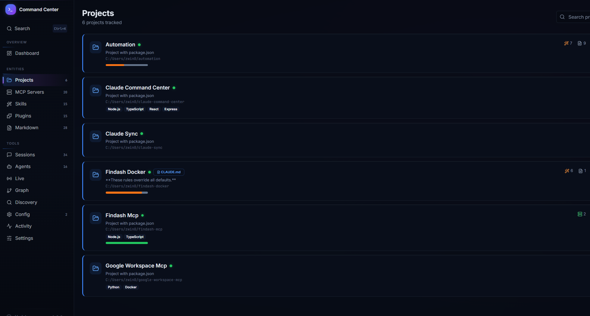
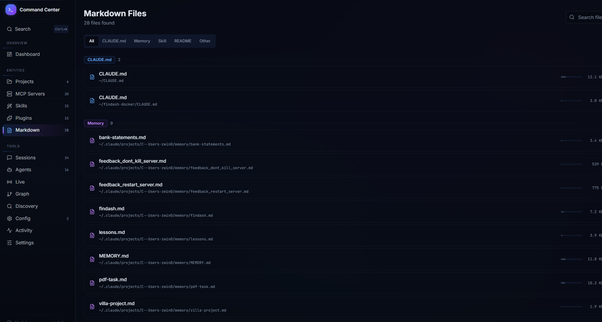

# Claude Command Center

A local dashboard for visualizing and managing your [Claude Code](https://docs.anthropic.com/en/docs/claude-code) ecosystem. Auto-discovers your projects, MCP servers, skills, plugins, sessions, agents, and their relationships with zero configuration.

Built for Claude Code power users who want a bird's-eye view of everything in their `~/.claude/` setup.

## Screenshots

| Dashboard | Graph |
|-----------|-------|
|  |  |

| Sessions | Live View |
|----------|-----------|
|  |  |

| MCP Servers | Agents |
|-------------|--------|
|  |  |

<details>
<summary>More screenshots</summary>

| Projects | Markdown Editor |
|----------|-----------------|
|  |  |

| Discovery |
|-----------|
|  |

</details>

## Quick Start

```bash
git clone https://github.com/sorlen008/claude-command-center.git
cd claude-command-center
npm install
npm run dev
```

Open [http://localhost:5100](http://localhost:5100) in your browser. The scanner will automatically find everything in your `~/.claude/` directory and home folder.

## Requirements

- **Node.js 18+** (tested on 20, 22, 24)
- **Claude Code** installed — the dashboard reads from `~/.claude/` which Claude Code creates
- **git** — required for the update feature (optional otherwise)

## What It Does

- **Auto-discovers** all Claude Code projects, MCP servers, skills, plugins, and markdown files across your home directory
- **Session browser** — search, filter, sort, and manage all your Claude Code sessions with bulk operations
- **Agent tracker** — see agent definitions and execution history across sessions
- **Live view** — real-time monitoring of active Claude Code sessions and running agents with context usage, message counts, and cost estimates
- **Graph visualization** — interactive node graph of your entire Claude Code ecosystem with AI-assisted suggestions for infrastructure nodes
- **Markdown editor** — edit `CLAUDE.md` and memory files directly in the browser with version history
- **Discovery** — finds potential projects and MCP servers you haven't configured yet
- **Config viewer** — inspect your Claude Code settings, MCP configs, and permissions
- **Activity feed** — timeline of recent file changes across your Claude Code setup
- **One-click updates** — check for and apply updates directly from the sidebar

## Pages

| Page | Description |
|------|-------------|
| **Dashboard** | Overview with entity counts, health indicators, and quick stats |
| **Projects** | All discovered projects with session counts, tech stack, and health status |
| **MCP Servers** | Every MCP server found in `.mcp.json` files across your system |
| **Skills** | User-invocable and system skills with content preview |
| **Plugins** | Installed and available plugins, marketplace links |
| **Markdown** | All `CLAUDE.md`, memory files, and READMEs with inline editing |
| **Sessions** | Full session history -- search by message content, sort by date/size, bulk delete |
| **Agents** | Agent definitions and execution logs grouped by type and model |
| **Live** | Real-time view of running Claude Code processes, active agents, context usage |
| **Graph** | Interactive node graph with custom nodes, AI suggestions, and `graph-config.yaml` |
| **Discovery** | Suggests unconfigured projects and MCP servers it found on disk |
| **Config** | Your Claude Code settings, permissions, and MCP configurations |
| **Activity** | Recent file-change timeline from the file watcher |

## Security and Privacy

**This tool runs entirely on your local machine.**

| Concern | Details |
|---------|---------|
| **File system access** | Reads `~/.claude/` and project directories under your home folder. Writes only to `~/.claude-command-center/` (its own database) and markdown files you explicitly edit. |
| **Shell commands** | Spawns: `claude -p` (AI graph suggestions), `git` (update checks), platform file openers (`explorer`/`open`/`xdg-open`), terminal emulators (session resume). User input in shell commands is validated with Zod (e.g. session IDs are restricted to UUID format). |
| **Network access** | The server binds to `127.0.0.1` only by default. No outbound requests except: optional GitHub API search (user-initiated, uses `GITHUB_TOKEN` env var if set) and `claude -p` subprocess (user-initiated). **Warning:** Setting `HOST=0.0.0.0` exposes the server to your network with no authentication. |
| **Data storage** | All data is stored locally in `~/.claude-command-center/command-center.json` as plain JSON. No cloud sync, no external databases. |
| **Telemetry** | None. No analytics, no tracking, no phone-home behavior. |
| **Secrets** | Never stored. MCP environment variables containing "secret", "password", "token", or "key" are redacted to `***` in the dashboard. |

For the full threat model, see [docs/security-threat-model.md](docs/security-threat-model.md).

## Configuration

| Variable | Default | Description |
|----------|---------|-------------|
| `PORT` | `5100` | Server port |
| `HOST` | `127.0.0.1` | Server bind address. **Do not set to `0.0.0.0` unless you understand the risk** — there is no authentication. |
| `COMMAND_CENTER_DATA` | `~/.claude-command-center/` | Data directory for the local database |
| `GITHUB_TOKEN` | (none) | Optional. Used for GitHub API rate limits in Discovery search |

```bash
PORT=3000 npm run dev
```

## Building for Production

```bash
npm run build    # Bundles client (Vite) + server (esbuild)
npm start        # Runs the production bundle
```

The production build outputs to `dist/` — a single `index.cjs` for the server and static assets in `dist/public/`.

## Updating

The sidebar shows an update indicator when new commits are available on the remote. Click it to check for updates and apply them (runs `git pull` + `npm install` + `npm run build`). Restart the server after updating.

Or manually:

```bash
git pull
npm install
npm run build
npm start
```

## Verifying Releases

Release artifacts are built in CI and include SHA-256 checksums.

```bash
# Download release and checksums (replace vX.Y.Z with the actual version)
curl -LO https://github.com/sorlen008/claude-command-center/releases/download/vX.Y.Z/claude-command-center-vX.Y.Z.tar.gz
curl -LO https://github.com/sorlen008/claude-command-center/releases/download/vX.Y.Z/checksums-vX.Y.Z.sha256

# Verify integrity
sha256sum -c checksums-vX.Y.Z.sha256
```

## Graph Configuration

The graph page auto-discovers entities and relationships. You can extend it with:

### Custom nodes via `graph-config.yaml`

Create `~/graph-config.yaml` or `~/.claude/graph-config.yaml`:

```yaml
nodes:
  - id: my-database
    type: database
    label: "PostgreSQL"
    description: "Primary database on :5432"

edges:
  - source: my-mcp-server
    target: config-my-database
    label: connects_to

overrides:
  - entity: my-project
    description: "Custom description"
    color: "#22c55e"
```

### AI-assisted suggestions

Click "AI Suggest" in the graph toolbar. This requires [Claude Code CLI](https://docs.anthropic.com/en/docs/claude-code) installed and authenticated. It analyzes your ecosystem and suggests infrastructure nodes and connections.

## Tech Stack

- **Frontend:** React 18, TanStack Query, Tailwind CSS, Radix UI, Wouter, React Flow
- **Backend:** Express 5, chokidar (file watcher), Zod (validation)
- **Build:** Vite (client), esbuild (server), TypeScript throughout
- **No external services required** — everything runs locally

## How It Works

On startup, the server scans your home directory for Claude Code artifacts:

1. **Projects** — directories with `CLAUDE.md`, `.mcp.json`, `package.json` + `.git`, or other project markers
2. **MCP servers** — parsed from every `.mcp.json` found (root, project-level, plugin-level)
3. **Skills** — from `~/.claude/skills/`
4. **Plugins** — from `~/.claude/plugins/`
5. **Sessions** — JSONL files from `~/.claude/projects/`
6. **Agents** — definition files from plugins + execution logs from sessions
7. **Relationships** — cross-references between all of the above
8. **Infrastructure** — Docker Compose services, database URLs from MCP env vars, `graph-config.yaml`

A file watcher (chokidar) keeps the data fresh — changes to any scanned file trigger incremental re-scans pushed via Server-Sent Events.

## Cross-Platform

Works on **Windows**, **macOS**, and **Linux**. Platform-specific actions (open folder, resume session) adapt automatically.

## Contributing

See [CONTRIBUTING.md](CONTRIBUTING.md).

## Security

See [SECURITY.md](SECURITY.md) for reporting vulnerabilities.

## License

[MIT](LICENSE)
